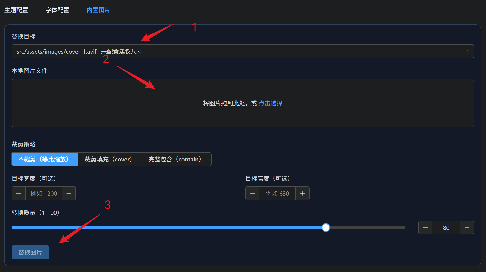

封面（Header Cover）是网站顶部的大型视觉区域，能给访问者留下第一印象。ShokaX 支持四种封面模式：

- **多图轮播**（默认）：自动循环显示预设图片。
- **固定封面**：始终显示同一张图片。
- **渐变模式**：通过 Bing 每日图片获取动态渐变背景。
- **高级轮播**：支持远程 URL 和自定义数量的图片轮播。

所有配置都在 `src/theme.config.ts` 的 `cover` 字段中。

## 默认配置

如果你刚下载主题，什么都不改，封面默认使用固定封面模式：

```ts title="src/theme.config.ts"
export default defineConfig({
  // ...
  cover: {
    enable: true,       // 启用封面
    preload: true,      // 图片预加载（提升性能）
    fixedCover: {
      enable: true,     // 启用固定封面
      url: "cover-4",   // 使用预设图片
    },
  },
});
```

## 固定封面

如果你想让封面始终显示同一张图片（比如你的 Logo 或品牌图），使用固定封面模式：

```ts title="src/theme.config.ts"
export default defineConfig({
  cover: {
    enable: true,
    preload: true,
    fixedCover: {
      enable: true,           // 启用固定封面
      url: "cover-3",         // 使用预设图片之一
    },
  },
});
```

### 可用的预设封面

主题内置了 6 张封面，你可以直接使用它们的 key：

- `"cover-1"`
- `"cover-2"`
- `"cover-3"`
- `"cover-4"`
- `"cover-5"`
- `"cover-6"`

:::tip[为什么推荐用预设？]
预设封面会走 Astro 的图片优化管线（自动压缩、格式转换、响应式处理），性能更好。
:::

## 使用自己的图片

如果你想用自己的图片做固定封面，有三种方式：

### 使用 HyC 交互式替换

参照[使用 HyC 交互式修改配置](/guides/configs/basic)，启动 HyC 控制台。

随后，在导航栏中选"博客配置"→"内置图片"，即可修改自带的 6 张预设图片：


在替换目标中选择你需要替换的图片，随后上传本地图片，点击替换即可。

HyC 会自动把格式转换为 AVIF 和裁剪压缩，原始图片文件可为任意图片格式。

### 放在 `public` 目录

1. 把图片放到项目的 `public/` 目录，例如 `public/my-cover.jpg`
2. 在配置中填写路径（以 `/` 开头）：

```ts title="src/theme.config.ts"
export default defineConfig({
  cover: {
    fixedCover: {
      enable: true,
      url: "/my-cover.jpg",
    },
  },
});
```

### 使用远程 URL

你也可以直接填写远程图片地址：

```ts title="src/theme.config.ts"
export default defineConfig({
  cover: {
    fixedCover: {
      enable: true,
      url: "https://example.com/my-cover.jpg",
    },
  },
});
```

:::caution
使用 `public` 路径或远程 URL 时，会使用 `` 标签直接渲染，不会经过 Astro 图片优化。如果你追求极致性能，建议把图片放到 `src/assets/images/` 通过 HyC 替换预设封面。
:::

## 多图轮播（默认）

如果不启用固定封面，主题会自动使用 6 张预设图片轮播：

```ts title="src/theme.config.ts"
export default defineConfig({
  cover: {
    enable: true,
    preload: true,
    fixedCover: {
      enable: false,    // 关闭固定封面
    },
  },
});
```

## 高级轮播模式

启用 `advancedCarousel` 后，轮播机制更加灵活——支持任意 ≥2 张图片即可轮播、支持远程 URL。

### 使用远程 URL 轮播

```ts title="src/theme.config.ts"
export default defineConfig({
  cover: {
    enable: true,
    advancedCarousel: true,           // 启用高级轮播
    coverUrls: [
      "https://example.com/cover-1.jpg",
      "https://example.com/cover-2.jpg",
      "https://example.com/cover-3.jpg",
    ],
  },
});
```

:::note
当 `advancedCarousel` 为 `true` 且 `coverUrls` 非空时，优先使用 `coverUrls`；否则，高级轮播会使用 `covers.config.ts`（通过 `hyc sync` 同步生成）中定义的 URL 列表。
:::

## 渐变模式

不想用图片？可以启用渐变模式，使用 Bing 每日图片生成动态渐变背景：

```ts title="src/theme.config.ts"
export default defineConfig({
  cover: {
    enable: true,
    gradient: true,     // 启用渐变模式
  },
});
```

:::note
渐变模式会通过 Bing API 获取每日图片作为背景，每次访问可能不同。启用渐变模式后固定封面和多图轮播不再生效。
:::

## 文章导航渐变背景

在文章页面底部的"上一篇/下一篇"导航区域，可以选择使用渐变背景：

```ts title="src/theme.config.ts"
export default defineConfig({
  cover: {
    nextGradientCover: true,    // 文章导航使用渐变背景
  },
});
```

这个选项独立于封面模式，可以单独启用。

## 配置项速查

| 字段 | 类型 | 默认值 | 说明 |
| :--- | :--- | :--- | :--- |
| `cover.enable` | `boolean` | `true` | 是否显示封面区域。 |
| `cover.preload` | `boolean` | `true` | 是否预加载封面图片（提升首屏速度）。 |
| `cover.fixedCover.enable` | `boolean` | `true` | 是否启用固定封面模式。 |
| `cover.fixedCover.url` | `string` | `"cover-4"` | 固定封面的图片源（预设 key / public 路径 / URL）。 |
| `cover.advancedCarousel` | `boolean` | `false` | 是否启用高级轮播（支持 ≥2 张图、远程 URL）。 |
| `cover.coverUrls` | `string[]` | `[]` | 远程 URL 轮播列表（需配合 `advancedCarousel`）。 |
| `cover.gradient` | `boolean` | `false` | 是否使用渐变模式（Bing 每日图片背景）。 |
| `cover.nextGradientCover` | `boolean` | `false` | 文章导航区域是否使用渐变背景。 |

## 封面模式优先级

当你同时配置了多个选项时，优先级如下：

1. **固定封面**：`fixedCover.enable: true` + `fixedCover.url` 有值时生效。
2. **渐变模式**：`gradient: true` 且未启用固定封面时生效。
3. **高级轮播**：`advancedCarousel: true` 时生效（优先 `coverUrls`，其次 `covers.config.ts`）。
4. **多图轮播**（默认）：上述都不满足时，使用 6 张预设图片轮播。

## 常见问题

### Q: 为什么启用了固定封面，但还是轮播？

检查两个条件是否都满足：

1. `fixedCover.enable` 设为 `true`
2. `fixedCover.url` 填写了有效的值（预设 key 或路径）

如果只设置了 `url` 而 `enable` 为 `false`，固定封面不会生效。
